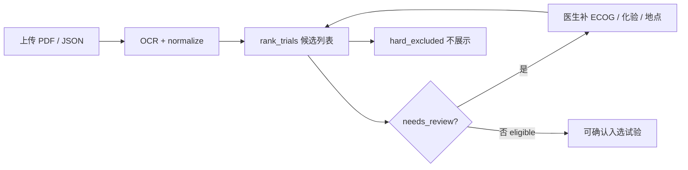

# 有救AI — 临床试验匹配系统阶段性汇报

> **汇报日期**：2026-06-03  
> **引擎版本**：`matcher_layers_v2`  
> **试验库**：496 条招募中项目（`trials_structured.json`）  
> **评测样本**：10 份真实病历 PDF → OCR → normalize → `*_fixed_matching.json`  
> **原始数据汇总**：`structured_data/stage_report_summary.json`

---

## 一、摘要

本阶段完成了「**病历 PDF → 结构化患者画像 → 规则匹配排序**」端到端流水线，并在 **10 例真实病历** 上做了 strict 模式批量评测。

**核心结论**：

1. **产品定位清晰**：系统给医生**筛选建议**，缺失 ECOG/化验等标「待核对」，**不因信息不全而零候选**（v2 筛查语义）。
2. **数据质量分层表现符合设计**：化验较全的病例（CHQI）可**收紧筛选**；结构化化验缺失的病例仍给出癌种相关候选并**明确缺什么**；零候选 3 例（LUFE/MSHU/TARU）主因是**疾病标签未对齐**。需区分：**源 PDF 缺化验** vs **OCR 漏抽**（见 §5.1.1）——后者不应算作「病历本身低质量」。
3. **低结构化质量与 OCR 超时/错误高度相关**（10 例中 9 例有 `errors` 记录；化验项≤1 的 7 例全部伴随页级 timeout 或 API 失败）。
4. **10 例中 7 例 strict 模式有候选**（0 候选 3 例，需后续 OCR/诊断规范化或试验库标签扩展）。
5. **本阶段尚未做医生金标准验证**；Top 排序为规则+软语义，不代表临床最终入组结论。

---

## 二、项目定位

| 维度 | 说明 |
|------|------|
| **目标用户** | 临床医生、研究协调员 |
| **输入** | 病历 PDF / OCR JSON / Web 表单 |
| **输出** | 按匹配度排序的试验候选列表 + 待核对项 + 硬排除原因 |
| **不是** | 自动入组决策；缺 ECOG 就拒绝所有试验 |

**三种结果标签（v2）**：

| 标签 | 含义 |
|------|------|
| **可确认入选** `eligible` | 规则全过 + 核心字段齐全 + 化验门槛过 |
| **建议候选（待核对）** `needs_review` | 进列表，但缺 ECOG/化验等或存在 unknown |
| **硬排除** `hard_excluded` | 已知违反年龄/ECOG/化验/排除条件，不进列表 |

---

## 三、数据流与流水线

```
original_data/dataset_patient/*.pdf
    ↓  豆包 hybrid OCR（scripts/batch_ocr.py）
output_patients/{stem}_患者信息.json
    ↓  化验清洗（scripts/fix_lab_result.py）
output_patients/{stem}_患者信息_fixed.json
    ↓  匹配整理（scripts/normalize_patient_for_matching.py）
output_patients/{stem}_患者信息_fixed_matching.json   ← 金标准工作文件
    ↓  规则匹配（codes/trial_matcher.py :: rank_trials）
候选试验列表（strict / balanced）
```

**文件名业务约定**（已接入 normalize）：

- `{内部码}{癌种}{可选:省/市}{可选:一线/二线…}.pdf`
- 示例：`CHQI胰腺癌辽宁沈阳.pdf`、`HAQI胃癌一线进展.pdf`
- 仅补缺失字段，冲突写入 `filename_conflicts`

---

## 四、本阶段已交付能力

| 模块 | 文件 | 能力 |
|------|------|------|
| 规则匹配引擎 v2 | `codes/trial_matcher.py` | 筛查语义、hard_excluded / needs_review / eligible |
| 12 项化验体系 | `codes/lab_lexicon.py`, `lab_rules.py` | P0×9 + P1×3，按**试验条款**逐项 pass/fail/unknown |
| 患者整理 | `codes/patient_matching_normalize.py` | 化验归一、biomarker、分期推断 |
| 文件名推断 | `codes/patient_filename_infer.py` | 癌种 / 线数 / 地点 |
| 地理距离 | `codes/geo_admin.py` | cpca + adcode，多中心最短距离 |
| 疾病匹配修复 | `patient_filename_infer` + `trial_matcher` | TNM 噪声、同义词、误配淋巴瘤 |
| 分期提取 | `infer_stage_from_text` | `（Ⅳ）`、TNM M1 等 → I–IV |
| 批量 OCR | `scripts/batch_ocr.py` | 跳过已成功 JSON、poppler、UTF-8 日志 |
| 文档 | `docs/MATCHING_CHECKLIST.md`, `SESSION_HANDOFF.md` | 规则清单与交接 |

**化验在匹配中的角色**：不是「每试验查满 12 项」，而是试验入排解析出哪几项，就用 `lab_observations` 对哪几项；**缺失 → unknown（不硬拒）**，**明确违反 → fail（strict 下 hard_excluded）**。

---

## 五、10 例病历评测

### 5.1 数据完成度分层

**重要区分**：「结构化化验数」反映的是 **OCR→normalize 后的系统输入**，不一定等于原始 PDF 是否含有化验。低结构化分数在多数病例中来自 **OCR 超时/ API 错误**，而非源文档本身缺失（见 §5.1.1）。

| 层级 | 病例 | 结构化化验数 | 缺 P0 项 | OCR 问题 | 说明 |
|------|------|-------------|---------|----------|------|
| **高** | CHQI 胰腺癌辽宁沈阳 | 11 | 1（plt） | 无 errors | 金标准样例，ECOG/地点/分期/biomarker 较全 |
| **中高** | HAQI 胃癌一线进展 | 5 | 5 | 1 页 timeout（第 14 页） | OCR 脏数据多；缺页可能少肝功；文件名补癌种/线数 |
| **中高** | MSHU 尿路上皮癌 | 5 | 5 | 5 页 timeout | 部分化验仍抽出；诊断文本复杂 → 零候选 |
| **中** | HZZH 胰腺癌无锡 | 1 | 8 | 5 页 timeout，5 页空文本 | 仅 inr；地点/癌种来自文件名 |
| **中** | LHBI 胰腺癌上海 | 1 | 8 | 6 页 timeout，6 页空文本 | 同上 |
| **中** | LSLI 胰腺 Ca 一线后 | 0 | 9 | 1 页 timeout | 无化验进系统；ECOG/biomarker 有 |
| **OCR 漏检** | CHRO 胆管癌四川 | 0 | 9 | **4 页全部 timeout**；仅 1 页病理有文本 | **人工核对：源 PDF 含所需化验**；见 §5.4 案例 C |
| **OCR 漏检** | LWPI 胃癌山东 | 0 | 9 | 6 页 errors（含 timeout / 400 参数错误） | 无化验进系统；ECOG/分期/癌种有 |
| **OCR 漏检** | LUFE 胶质母沧州 | 0 | 9 | 2 页 timeout | OCR 极少；诊断「脑恶性肿瘤」→ 零候选 |
| **OCR 漏检** | TARU 胶质母长春 | 0 | 9 | 3 页 errors（含 **403 欠费**） | 仅 meta 行；零候选 |

**PDF 进度**：18 份中已完成 OCR **10 份**；其余 8 份因豆包 API 账户欠费（`AccountOverdueError`）中断，充值后可 `python scripts/batch_ocr.py` 续跑。

### 5.1.1 OCR 问题与「低质量」的关系

对 10 份 `*_fixed_matching.json` 统计 OCR 层 `errors` 与空页：

| 病例 | 总页数 | 空页数 | 结构化化验 | errors 数 | 主要 error 类型 |
|------|--------|--------|-----------|----------|----------------|
| CHQI | 12 | 0 | 11 | 0 | — |
| HAQI | 22 | 0 | 5 | 1 | Request timed out |
| MSHU | 22 | 5 | 5 | 5 | Request timed out |
| HZZH | 12 | 5 | 1 | 5 | Request timed out |
| LHBI | 17 | 6 | 1 | 6 | Request timed out |
| LSLI | 13 | 1 | 0 | 1 | Request timed out |
| **CHRO** | **4** | **3** | **0** | **4** | **全部页 timeout** |
| LWPI | 13 | 6 | 0 | 6 | timeout / InvalidParameter |
| LUFE | 8 | 2 | 0 | 2 | Request timed out |
| TARU | 9 | 3 | 0 | 3 | timeout / AccountOverdueError |

**结论（本阶段重要发现）**：

1. **唯一无 OCR error 且化验最全的是 CHQI**（11 项），匹配结果最可代表引擎「正常输入」下的表现。
2. **结构化化验 ≤1 的 7 例均伴随页级 OCR 失败**（timeout 为主，少数 400/403）。
3. 因此汇报中的「低质量」应表述为 **「OCR 输入不完整」**，而非笼统「病历质量差」。
4. **CHRO 已人工核对**：原始 PDF 含血常规、肝肾功能等，但 4 页 OCR 均 timeout，仅 hybrid 复扫留下 1 页病理报告 → 系统误判为「缺 9 项 P0」。该例**不纳入「源文档无化验」样本**，归类为 **OCR 漏检 / 待重跑**。

**对匹配解读的影响**：在 OCR 漏检病例上，strict 宽召回（如 CHRO 50 候选、47 待核对）体现的是 **输入缺失下的筛查策略**，不能当作该患者真实可匹配能力的上界；补 OCR 或人工补录 P0 后应复评。

### 5.2 strict 模式匹配结果总表

（候选上限 50；试验库 496 条）

| 病例 | 癌种 | 化验项 | strict 候选数 | 可确认 eligible | 待核对 needs_review | Top1 疾病标签 | 备注 |
|------|------|--------|--------------|-----------------|---------------------|--------------|------|
| CHQI | 胰腺癌 | 11 | **7** | 7 | 4 | 胰腺癌 | 数据全 → 能收紧 |
| CHRO | 胆管癌 | 0 | **50** | 3 | 47 | 肝内胆管癌 | **OCR 漏检**（源 PDF 有化验）；宽召回 + 待核对 |
| HAQI | 胃癌 | 5 | **2** | 0 | 2 | 胃癌 | 缺 ECOG/P0 → 候选少但非零；非淋巴瘤 |
| HZZH | 胰腺癌 | 1 | **15** | 0 | 15 | 胰腺癌 | 全待核对 |
| LHBI | 胰腺癌 | 1 | **50** | 4 | 46 | 胰腺癌（实体瘤） | 同 CHRO 模式 |
| LSLI | 胰腺癌 | 0 | **11** | 11 | 10 | 胰腺癌 | 无化验但 core 较齐 |
| LWPI | 胃癌 | 0 | **13** | 13 | 12 | 胃癌 | 缺化验但 ECOG/分期有 |
| LUFE | 脑恶性肿瘤 | 0 | **0** | 0 | 0 | — | 癌种与试验库标签未匹配 |
| MSHU | 尿路上皮相关 | 5 | **0** | 0 | 0 | — | 诊断表述与「尿路上皮癌」标签未对齐 |
| TARU | 胶质母细胞瘤 | 0 | **0** | 0 | 0 | — | 试验库该癌种覆盖或标签匹配待查 |

**汇总**：10 例中 **7 例有候选**（70%）；**0 候选 3 例**（LUFE/MSHU/TARU），主因是**疾病标签匹配**而非化验硬拒。

### 5.3 稳健性：我们如何定义、如何用 10 例说明

| 稳健维度 | 设计 | 10 例中的体现 |
|----------|------|---------------|
| **筛查不中断** | 缺 ECOG/化验不 hard_excluded | HAQI 缺 ECOG 仍有 2 条 strict 候选；CHRO 0 化验仍有 50 条 |
| **差数据可降级** | unknown + needs_review + next_steps | CHRO/LHBI Top 候选几乎全待核对，报告缺 P0（**多为 OCR 未抽出，非源文档无**） |
| **好数据可收紧** | fail / exclusion → hard_excluded | CHQI 仅 7 条 strict（非 496 全进） |
| **疾病不误配** | TNM/同义词修复 | HAQI Top 为**胃癌**，不再误配 T/NK 淋巴瘤 |

### 5.4 深度案例（建议汇报时展开 3 个）

#### 案例 A — CHQI（高质量输入）

- **输入**：胰腺癌、沈阳、ECOG 1、IV 期、11 项化验、KRAS/PD-L1/TMB 等 biomarker
- **strict**：7 候选，7 可确认；Top1 `NM20210726` 胰腺癌试验，score 103.3
- **说明**：数据较全时系统**收窄**到少量高相关试验，适合「可确认入选」演示

#### 案例 B — HAQI（复杂 OCR + 关键 bug 修复）

- **输入**：OCR 诊断含 `TXNXM1（Ⅳ）`；文件名补 `胃癌`、`一线`
- **修复前问题**：`T` 误匹配「T/NK 细胞淋巴瘤」；`（Ⅳ）` 未进 `cancer_stage`
- **修复后**：Top 为胃癌试验；`cancer_stage=IV`；strict 2 候选（其余因化验/排除 hard_excluded，非零候选 bug）
- **待核对**：ECOG（KPS 80≈1 需医生确认）、alt/ast/cr/tbil/aptt

#### 案例 C — CHRO（OCR 漏检，非源文档无化验）

- **源 PDF（人工核对）**：含血常规、肝肾功能等所需化验；4 页 PDF 中化验/检查报告与病理并存。
- **OCR 实际结果**：4 页均 `Request timed out`；`raw_ocr_texts` 仅第 2 页留下病理报告文本，其余 3 页为空 → `lab_observations=0`。
- **系统输入**：文件名推断胆管癌、四川；年龄 52、性别女来自病理页；**无 diagnosis / ECOG / 化验**。
- **strict**：50 候选，仅 3 可确认，47 待核对。
- **应如何解读**：
  - **匹配层**：在「系统以为没有化验」时仍给出候选并标缺 9 项 P0 → **输入缺失下的稳健行为**。
  - **OCR 层**：**漏检**，不能说明该患者真实无化验；**不能**将本例 Top 排序当作临床匹配结论。
- **汇报话术**：「CHRO 证明引擎对缺失输入不崩溃；同时暴露 OCR 超时是现阶段最大瓶颈。重跑 OCR 或人工补 P0 后应复评。」

---

## 六、匹配逻辑速查（汇报用）

```
进候选列表 = disease_match ∧ ¬hard_excluded

hard_excluded 触发：
  · 年龄/性别/ECOG/线数 已知且违反
  · 入组化验 fail（strict）
  · 排除化验命中

needs_review 触发：
  · 缺 ECOG / 线数 / 年龄等 core 字段
  · 化验 unknown（患者缺该项）

软排序：地理距离、Jaccard 语义、分期/biomarker 文本（不参与硬过滤）
```

**匹配模式**：

- **strict**（默认）：化验 fail → 不进列表
- **balanced**：入组化验 fail ≤ 1 仍可进列表

---

## 七、已知局限（汇报建议主动说明）

| 类别 | 说明 |
|------|------|
| **OCR 超时/ API 错误（主因）** | 10 例中 9 例有 `errors`；化验≤1 的 7 例**全部**伴随页级 timeout 或 400/403。CHRO 已人工确认源 PDF 有化验但未抽出。限制匹配准确度的是**输入层**，不是规则引擎本身 |
| **OCR 漏检 vs 源文档缺失** | 须区分：前者应重跑 OCR / 人工补录；后者才属真实数据缺口 |
| **疾病标签** | LUFE/MSHU/TARU 零候选，需同义词/诊断规范化或试验库标签对齐 |
| **×ULN** | 部分相对阈值未稳定解析 → unknown |
| **Biomarker** | PD-L1/MSI/KRAS 等仅软排序，未全面硬规则化 |
| **向量/Faiss** | 有建库脚本，**未接入** demo / 默认匹配入口 |
| **医生验证** | Top 排序尚无金标准标注 |
| **样本量** | 18 PDF 中仅 10 份 OCR 完成；8 份待 API 恢复 |

---

## 八、医生工作流（产品闭环）



---

## 九、后续规划（评测驱动）

| 优先级 | 任务 | 触发/依据 |
|--------|------|-----------|
| **P0** | 豆包 API 充值；OCR 剩余 8 份 PDF | 样本 10→18 |
| **P0** | **OCR 稳定性**：超时页重试、单页重跑、调大 timeout；CHRO/LWPI/LUFE 等漏检病例重 OCR | §5.1.1：低结构化质量主因 |
| **P0** | 10 例 **医生标注** Top3 是否合理 | 本报告评测表 |
| **P1** | 人工补全 HAQI/LSLI/CHRO 等 ECOG、P0 化验（OCR 补不全时） | missing_p0 / 人工核对 |
| **P1** | 诊断规范化：`diagnosis_raw` + `cancer_type` 对齐试验标签 | MSHU/LUFE/TARU 零候选 |
| **P2** | 化验 ×ULN、biomarker **硬规则**扩展 | 试验库高频条款 |
| **P2** | 实体瘤 vs 血液瘤、标签层级收紧 | 误配防护 |
| **P3** | 接入 Faiss 向量排序 | 规则满足后排序仍不满意时 |
| **P3** | 匹配解释 UI / HTML 报告增强 | 医生采纳率 |

---

## 十、附录：复现命令

```powershell
cd "d:\Work\有救AI"

# 单份 normalize + 匹配预览
python scripts/normalize_patient_for_matching.py --file "output_patients/CHQI胰腺癌辽宁沈阳_患者信息_fixed.json" --run-match

# 批量 OCR（跳过已完成）
python scripts/batch_ocr.py

# 离线 HTML 报告
python scripts/run_match.py

# Web 演示
python scripts/demo_server.py

# 测试
python -m pytest tests/test_matcher_v2.py tests/test_geo_admin.py tests/test_filename_and_disease_match.py -q
```

---

## 十一、一句话总结

> 本阶段已打通 **496 试验 × 10 例真实病历** 的匹配闭环；引擎 v2 在**信息缺失时不中断筛查、在信息充分时能收紧结果**。本阶段**主要瓶颈在 OCR 层**（超时/漏页导致化验未进系统，CHRO 等已人工证实源 PDF 有化验）。下一步优先 **OCR 重跑与稳定性、医生标注、漏检病例补录**，再迭代 ×ULN 与 biomarker 硬规则。
